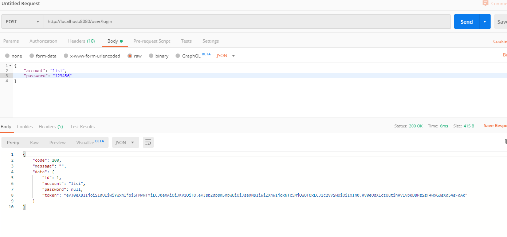
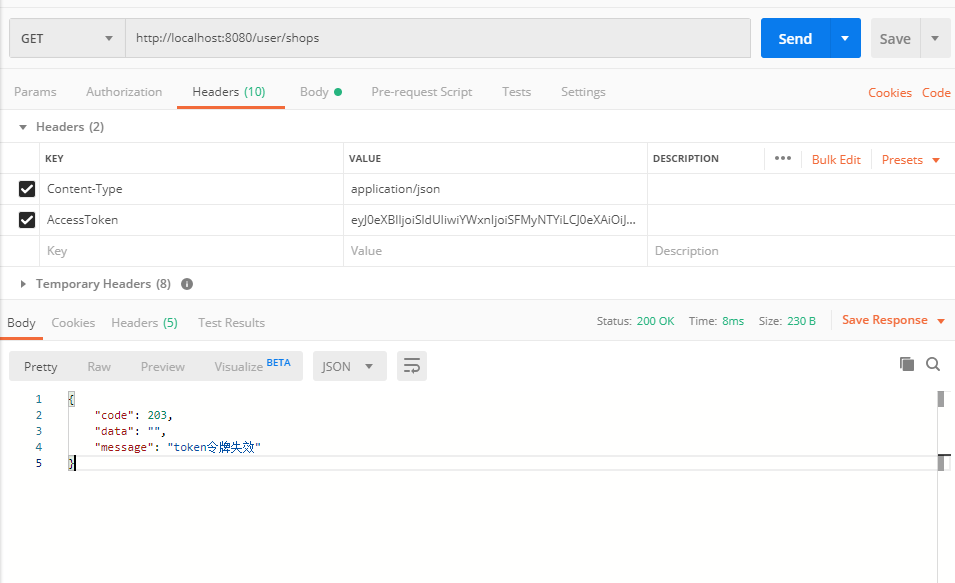
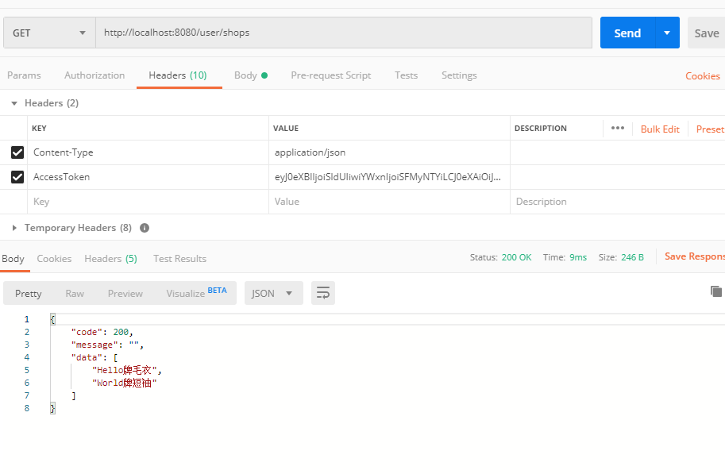

##### token 签发
#### 依赖
[java_token](!https://github.com/auth0/java-jwt)

#### 项目目录

```bash
|-- com.token
    |-- controller
        |-- UserController.java    # user模块的路由请求
    |-- entity                     # 实体对象 
        |-- User                    
        |-- UserToken               
    |-- interceptor                 # 拦截器
        |-- RequestInterceptor    # 拦截器过滤器及自定义拦截配置生效  
        |-- RouterInterceptor   # 自定义路由请求拦截器
    |-- service
        |-- impl
            |-- UserServiceImpl     # user模块下的业务逻辑实现
        |-- IUserService        # 接口
    |-- utils
        |-- ResultUtil          # 统一返回给前端的结果集
        |-- StatusCode          # 返回的状态码
        |-- TokenUtil           # token 生成， 验证， 解析方法
```

### 请求

```bash
http:localhost:8080/user/login
    - type： post
    - body:  {account:"lisi", password:"123456"}
    - response: {code:"", message:"", data: ""}
```
```bash
http:localhost:8080/user/shops
    - type： get
    - params: {}
    - response: {code:"", message:"", data: ""}
```
 
 
 